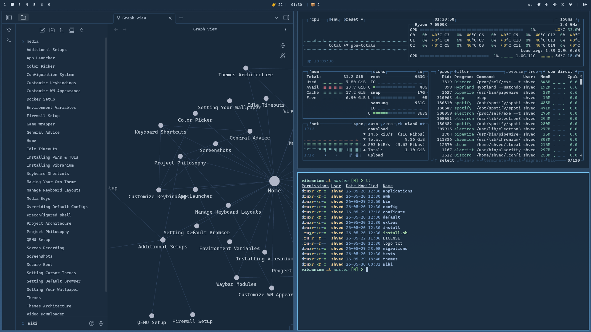

# [Lumon](https://github.com/basecamp/omarchy/tree/dev/themes/lumon) for Vibranium



## Installation

You can install it via Vibranium Menu or by using this command:

```bash
vb-theme-install https://github.com/shvedes/vibranium-theme-lumon
```
